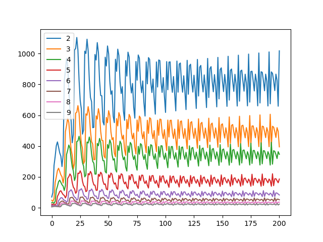

## 1.3.1 .1单品种蝗虫数量预测

### 问题描述

我们以国内最为常见的东亚飞蝗*（Locusta migratoria manilensis）*为例，进行建模，给出预测不同生命阶段群体随时间的变化。

### 研究对象分析

适宜环境下，虫卵一般需要14-30天进行孵化；幼蝗孵出后，7天脱一次皮，脱一次皮为一龄，共脱5次皮后羽化变为成虫；成虫羽化后，需经1～2周时间补充营养和飞翔，才能交配产卵；寿命55～60天左右。

下表为东亚飞蝗的生命各阶段与对应的龄期：

| 生命阶段（Life Stage）       | 龄期       |
| ---------------------------- | ---------- |
| 虫卵                         | 14-30天    |
| 一龄                         | 7-8天      |
| 二龄                         | 7-8天      |
| 三龄                         | 7-8天      |
| 四龄                         | 7-8天      |
| 五龄                         | 7-8天      |
| 成虫发育期（为交配储存营养） | 7-14天左右 |
| 成虫交配期                   | 至生命结束 |

理想环境下，寿命可达60天左右。

东亚飞蝗无滞育现象，所以只要环境适宜，就会不断发育，完成一次又一次的生命循环。

### 改进的Leslie矩阵预测模型

#### 研究思路

在适宜的环境下，蝗虫幼虫发育速度较为稳定且趋向最快速度，不会出现由于食物不足和温度过低，造成发育速度降低或者停滞的显现。在这种条件下，龄期与时间处于稳定的关系，因此我们可以基于Leslie模型进行建模。

用个体发育阶段代替年龄类别的类似模型称为Lefkovitch矩阵模型。由于东亚飞蝗无滞育现象且无法获取足够营养完成发育的个体也将没有足够的生存能力而被自然选择（死亡），因此我们可以认为留滞于当前阶段的情况发生，我们仍然采用Leslie模型进行改进建模。

#### Leslie模型简介

莱斯利（Leslie）模型是种群生态学中最常用的模型之一，用于模拟一段时间内生物种群的变化。是一种年龄结构人口的离散时间模型，描述了生物的发育，死亡率和繁殖。该模型是使用线性代数制定的。

该模型主要用于回答以下两个问题：

1. 指数增长率（本征增长率）是多少？
2. 每个年龄段在稳定年龄分布中所占的比例是多少？

#### Leslie模型的理论改进

##### 1.可变矩阵元素

生物的存活率和繁殖率可能取决于多种因素：温度，栖息地特征，天敌，食物等。为表示这些依赖性，Leslie模型的元素可以用方程式代替，该方程式将存活率和繁殖率指定为各种因素。方程可以从实验数据中获得。

##### 2.将生命周期划分为多个阶段 

许多无脊椎动物物种具有复杂的生命周期，包括多个阶段。例如，全代谢昆虫通常分为四个阶段：卵，幼虫，p和成虫。这些阶段中的每个阶段都可以包括几个年龄间隔：在这些模型中，不再以日历时间单位（例如，天或年）来衡量年龄。取而代之的是，它以独立的单位进行测量，这可以解释为“生理年龄”。它可以用来定义“发育速度”，即每个日历时间单位的生理年龄的平均增量。


#### 模型建立

##### 模型假设

+ 研究的目标东亚飞蝗种群处于适宜的环境（最适温度、最适湿度，四季如春），排除非生物因素的干扰
+ 所处环境稳定，无突发影响蝗虫种群生长发育繁殖的突发情况（如爆发虫疫等）发生
+ 无蝗虫种群的迁出迁入
+ 天敌数量稳定（无迁出迁入，如鸭军进犯等），且捕食率稳定（如天敌不会转变口味等）
+ 空间分布带来的相关影响较小
+ 蝗虫种群处于稳定的散居型，密度适中，无相互拥挤，造成不停戳后腿，造成的类型转变（转变为暴躁的群居型）
+ 由于环境承载力有限，会出现个体食物分配不足的现象。假设食物的缺乏只会造成存活率的下降（死亡率上升），不会导致发育速度减缓（龄期延长）
+ 由于食物缺乏，不会造成孵化率下降。但会造成交配期成虫的产卵数量减少
+ 蝗虫发育速度较为稳定且趋向理论最快速度

龄期假设

| 虫卵 | 各龄段幼虫（1-5） | 成虫发育期 | 成虫繁殖期 |
| ---- | ----------------- | ---------- | ---------- |
| 14天 | 7天               | 7天        | 7天        |

我们发现发育时期基本为7天一个时期，故我们做如下调整，以7天为一个时间单位（即一周为一个单位）

| 虫卵0期 | 虫卵1期 | 各龄段幼虫（0-4） | 成虫发育期 | 成虫繁殖期 |
| ------- | ------- | ----------------- | ---------- | ---------- |
| 7天     | 7天     | 7天               | 7天        | 7天        |

##### 相关符号表示

| 符号              | 含义                                                         |
| ----------------- | ------------------------------------------------------------ |
| $t$               | 从开始的第$t$周，$t\in \mathbb{N}$                           |
| $x$               | 第$x$个虫龄阶段,$x\in\{1,2,\dots,7\}$                        |
| $P_x(t)$          | 第$t$周第$x$个虫龄阶段的个体数量                             |
| $P(t)$            | 第$t$周总蝗虫数量                                            |
| $\vec{P}(t)$      | 第$t$年蝗虫数量向量，$\vec{P}(t)=(P_1(t),P_2(t),\dots,P_{7}(t))$ |
| $\kappa(\vec{P})$ | 环境压力关于蝗虫数量向量的函数                               |
| $F(\kappa)$       | 生育率关于环境压力的函数                                     |
| $S_x(\kappa)$     | 第$x$个虫龄阶段存活率关于的环境压力的函数                    |

###### 各虫龄段对应虫龄编号

| 变量 | 虫卵0期 | 虫卵1期 | 一龄 | 二龄 | 三龄 | 四龄 | 五龄 | 成虫发育期 | 成虫繁殖期 |
| ---- | ------- | ------- | ---- | ---- | ---- | ---- | ---- | ---------- | ---------- |
| $x$  | 1       | 2       | 3    | 4    | 5    | 6    | 7    | 8          | 9          |

##### 模型建立

###### 环境压力函数

在模型假设中，我们假设最适温度、最适湿度，排除了环境中非生物因素带来的干扰。因此关于环境压力我们只需考虑来自生物因素带来的影响。而生物因素中，主要以个体能得到的食物量和天敌捕食因素为主。而我们假设天敌捕食较为稳定；个体能得到的食物量则与食物总量成正比和个体数量成反比，其中我们假设了食物总量稳定，那么就与个体数量有关，而蝗虫在不同的生命阶段所消耗的食物量是不同的，比如幼虫阶段食量较小，成虫食量较大。

这里环境压力，我们先仅考虑同类竞争造成的食物缺乏引起的压力，天敌捕食将在存活率函数考虑。
$$
\kappa(\vec{P})=\vec{I}\cdot\vec{P}
$$
这里$\vec{I}$是蝗虫食量向量，比如$I_x$是$\vec{I}$第$x$个分量代表第$x$个虫龄阶段个体进食量。

例如$I_0,I_1=0$，因为虫卵不进食。$I_8,I_9$代表成虫阶段的个体进食量。

###### 生育率函数

蝗虫成虫繁殖期产卵数量受个体营养程度有关，如果食物缺乏，营养不足，产卵量减少、虫卵质量下降（孵出的幼虫生存能力不足)。我们将虫卵质量下降等结果统一归结为产卵量减少来研究。

这里采用LOGISTIC函数模型，刻画由环境压力造成的繁殖能力下降，
$$
F=\gamma(1-\frac{\kappa}{\kappa_M})
$$
其中$\gamma$表示基础生育率。$\kappa_M$表示最大环境压力（即食物消耗殆尽），当环境压力$\kappa=\kappa_M$时

###### 存活率函数

存活率$S_x$表示第$x$个虫龄阶段的个体存活下来并成功进入下一个生命阶段的比率，与天敌捕食和食物量有关

不同生命阶段的个体生存能力不同，体现在觅食能力，躲避天敌的能力上
$$
S_x=
\begin{equation}
\begin{cases}
\beta_x&x=1，2\\
\beta_x(1-\frac{\kappa}{\kappa_M})&x=3,4，\cdots,9
\end{cases}
\end{equation}
$$

其中$\beta$表示基本存活率,其中虫卵期无需进食，所以不会受到环境压力影响

###### Leslie矩阵

$$
L=
\left[
\begin{matrix}
&&&&F \\
S_1 \\
& S_2 \\
&& \ddots \\
&&& S_8
\end{matrix}
\right]
$$

第$t+1$周蝗虫数量向量可由第$t$周蝗虫数量向量得出
$$
\vec{P}(t+1)=L(P)\vec{P}(t)
$$

##### 模型求解

> 由于缺乏真是数据，故我们做一个模拟数据来验证模型的基本合理性

###### 假设数据

> 在代码中出现

###### 实现代码

```python
import pandas as pd 
import numpy as np 
from matplotlib import pyplot as plt  

I = np.array([0,0,.05,.05,.1,.1,.2,1,1])
r = 50
beta = [1,.6,.7,.7,.7,.8,.9,.9]
KM = 500
init = [100*(.7**i) for i in range(9)]

def K(P):
    return I @ P

def F(k):
    return r*(1-k/KM)

def S(x,k):
    return beta[x]*(1 if x < 3 else (1-k/KM))

def L(P):
    k = K(P)
    A = np.zeros((9,9))
    for i in range(8):
        A[i+1,i] = S(i,k)
    A[0,8] = F(k)
    return A

df = pd.DataFrame(columns=[i for i in range(1,10)])
df.loc[0] = init
for i in range(50):
    P = df.loc[len(df)-1]
    df.loc[len(df)] = L(P) @ P

for i in range(2,10):
    plt.plot([*range(len(df))],df[i],label=i)
plt.legend()
plt.show()
```

###### 运行结果



###### 实验结果分析

如输出结果，我们可以看出蝗虫种群数量呈现周期性变化，符合自然界中周期性变化规律；

## 1.3.1.2 双品种蝗虫数量预测

我们对上述单品种预测模型进行改进，并进一步抽象成多品种预测模型

### 研究对象分析

多品种蝗虫处于同于环境内，相比于单一品种，除了种群内部个体的竞争，还包括不同品种之间的相互竞争。

品种间竞争，包括竞争相同的食物资源；拥有共同的天敌，若一个品种属于有毒品种，那么天敌则会偏向于捕食无毒品种，造成不同品种间的存活率差异

### 分块Leslie矩阵模型

#### 模型假设

+ 包括上述单品种预测模型的全部假设
+ 品种间相互竞争以竞争相同的食物资源为主，无相互捕食对方幼虫或虫卵的竞争行为

#### 模型建立

设有$N$个品种$A_1,A_2,\cdots,A_N$

这几个品种的龄期长度可能不同，我们可以最精细以一天为一个单位，将龄期划分为多个时段（如上述单一品种模型对卵期的划分）

划分之后，$A_i$有$n_i$个划分龄期时段即为$x_{i1},x_{i2},\cdots,x_{in_i}$

这里我们相应的调整环境压力函数为
$$
\kappa(\vec{P})=\sum_{i=1}^N\vec{I_i}\cdot\vec{P_i}
$$
这里$\vec{I_i}$是$A_i$品种蝗虫食量向量，$\vec{P_i}$是$A_i$品种蝗虫各划分龄段数量向量，$\vec{P}=[\vec{P_1}\vec{P_2}\cdots\vec{P_{n_i}}]$的拼接向量

则可通过公式预测：
$$
\left[
\begin{matrix}
P_1(t+1)\\
P_2(t+1)\\
\vdots\\
P_N(t+1)
\end{matrix}
\right]
=
\left[
\begin{matrix}
L_1&&&&\\
&L_2&&&\\
&&\ddots\\
&&&&L_{N}
\end{matrix}
\right]
\left[
\begin{matrix}
P_1(t)\\
P_2(t)\\
\vdots\\
P_N(t)
\end{matrix}
\right]
$$
这里$L_i$是$A_i$的$Leslie$矩阵,上述公式可根据矩阵的分块乘法来进行