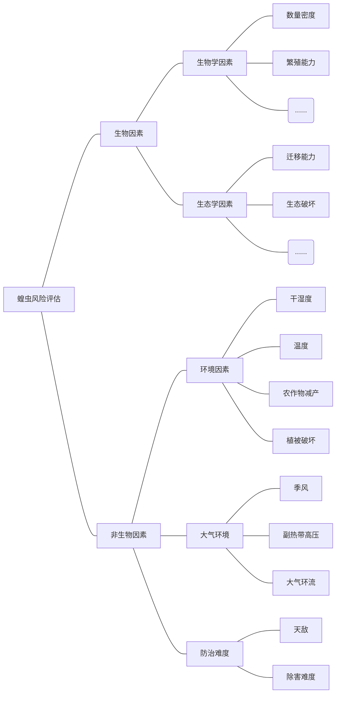

```mermaid
graph LR
A[蝗虫风险评估] ---B[生物因素]
A ---C[非生物因素]
B ---D[生物学因素]
B ---E[生态学因素]
C ---F[环境因素]
C ---G[大气环境]
C---U[防治难度]
D---H[数量密度]
D---I[繁殖能力]
D---P(......)
E---J[迁移能力]
E---K[生态破坏]
E---Q(......)
F---L[干湿度]
F---M[温度]
F---N[农作物减产]
F---O[植被破坏]
G---R[季风]
G---S[副热带高压]
G---T[大气环流]
U---V[天敌]
U---W[除害难度]
```

